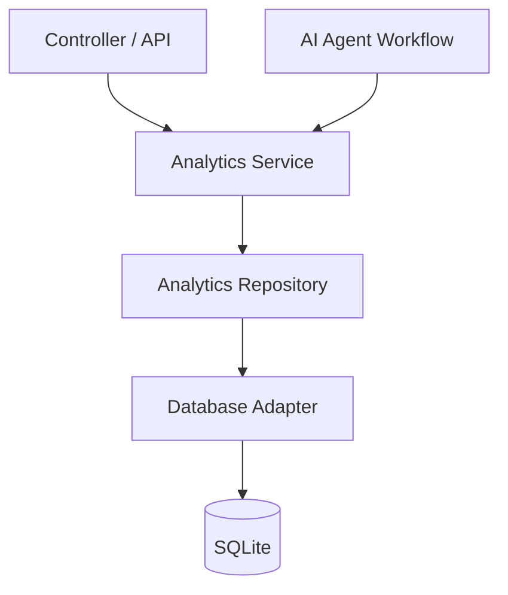

# Analytics Engine Architecture

## Responsibilities

- Controllers expose stable REST endpoints for dashboards.
- Analytics Service transforms request context into normalized event payloads.
- Repository abstracts persistence so the same service works with SQLite today and another database later.
- Database adapter owns schema and storage-specific logic.
