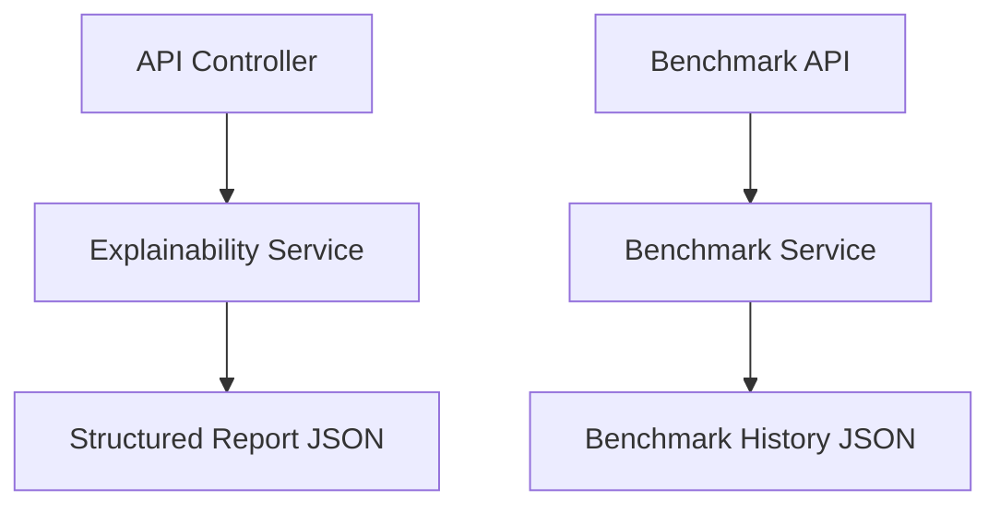

# Explainability and Benchmark Architecture

## Responsibilities

- Explainability Service converts retrieval decisions into structured, human-readable reports.
- Benchmark Service stores comparable metrics across execution pipelines and supports future model expansion.
- Controllers expose stable JSON endpoints without touching the UI.
